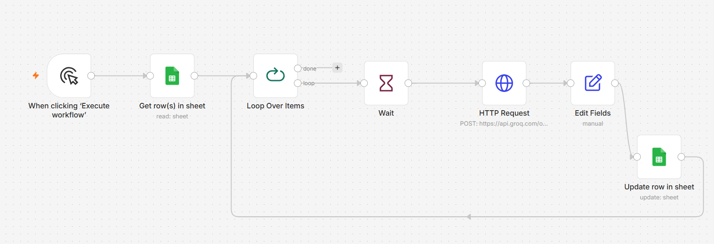

# AI-Driven Social Listening & Automated Sentiment Analytics Pipeline

An automated pipeline that reads customer reviews and uses AI to figure out whether each review is positive or negative, and what the actual problem is — then shows everything on a live dashboard.

## Tech Stack

## 1. Business Problem

A fast-growing app, such as an e-commerce or fintech app, receives thousands of customer reviews every day. The support team was manually reviewing these reviews, which could take **4–5 days to identify serious issues** such as payment failures or app crashes. By the time a problem was detected, it may have already affected a large number of customers and impacted the business.

**Goal:** Build an automated pipeline that reads customer reviews, uses AI to understand their sentiment and identify the underlying issue, and presents these insights on a live dashboard. This allows problems to be identified quickly without requiring the team to manually review every customer review.

## 2. How the Solution Works

The pipeline automatically moves customer reviews from raw data to actionable insights.

1. **Data Ingestion** — 300 real Amazon Shopping reviews from a Kaggle dataset are loaded into Google Sheets. The original dataset contains 90,000+ reviews.

   **Dataset:** [Amazon Shopping Reviews — Kaggle](https://www.kaggle.com/datasets/ashishkumarak/amazon-shopping-reviews-daily-updated)

2. **n8n Automation** — n8n reads each review, sends it to the AI model, and saves the analysis back to Google Sheets.

3. **AI Analysis** — Groq with LLaMA-3 identifies the **sentiment** (Positive, Negative, or Neutral) and the **core issue** (e.g., Late Delivery or App Crash).

4. **Data Storage** — Google Sheets stores the original reviews along with the AI-generated results.

5. **Streamlit Dashboard** — Streamlit reads the processed data and displays it through charts and a searchable review table. The dashboard refreshes automatically every 60 seconds.

### n8n Workflow

The workflow processes reviews one by one, sends them to the AI for analysis, and saves the results back to Google Sheets until all reviews are processed.

## 3. What the Data Showed (Key Insights)

After running the pipeline on the 300 sample reviews, some clear patterns showed up:

- **Customer Service got the most negative reviews.** Almost every review mentioning customer service was negative — this seems to be the biggest problem area, even more than app bugs.

- **Delivery problems were also mostly negative.** Reviews about "Shipping", "Late Delivery", and "Delivery Delay" were mostly negative too — this points to a delivery/logistics problem, not the app itself.

- **Pricing and Convenience got mostly positive reviews.** People seem happy with the price and how easy the app is to use — this part is working well.

- **Some app versions had more negative reviews than others.** One version in particular (**v26.23**) had a noticeably higher number of negative reviews, which could mean that update introduced a bug or made something worse.

- **The AI could also handle reviews in other languages (like Arabic).** It was able to give sentiment results for these reviews, not just English reviews.

## 4. Recommendations

Based on what the data showed, here's what could be done next:

- **Look into customer service first.** Since it has the most negative reviews, checking response time and support quality here would likely help the most.

- **Treat delivery issues separately from app bugs.** Late delivery complaints are a logistics problem, not something the app team can fix — these should go to the operations/delivery team.

- **Check what changed in version v26.23.** Since this version has more negative reviews than others, comparing it with the release notes could help find what went wrong.

- **Keep doing what's working — pricing and ease of use.** Any future changes to the app should be careful not to hurt these two things, since people already like them.

- **Add automatic alerts.** The pipeline could be extended so that if a serious issue (like "Payment Fail") suddenly increases in a day, the support team gets an email or message right away, instead of someone having to check the dashboard.

- **This can be scaled up later.** Right now it only uses 300 reviews as a demo, but the same pipeline can handle thousands of reviews — this would mean using a proper database instead of Google Sheets, and running the workflow automatically on a schedule instead of manually.
